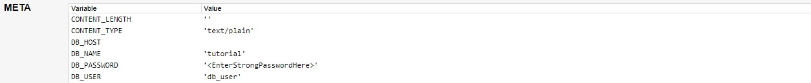

# HCMUS-CTF 2020 write ups
## Web Exploitation
### Math
Truy cập vào trang web, ta thấy web cho 1 dãy các phép tính, và ta cần tìm ra kết quả của phép tính có độ dài dài nhất trong số đó. 
Tuy nhiên các phép tính lại được bọc giữa các chuỗi làm nhiễu như `"Calculate them", "hurry up!", "awww"`, nên cần filter chúng trước.  
``` python
for equation in equations:
		for data in filterData:
			equation = equation.replace(data, '')
		realEquations.append(equation)
```
sau đó tìm chuỗi dài nhất và tính nó
``` python
maxI = 0
maxLength = 0
for i in range(0, len(realEquations)):
    if len(realEquations[i]) > maxLength:
        maxLength = len(realEquations[i])
        maxI = i
result = eval(realEquations[maxI])
```
Full script exploit nằm ở ./Math/exploit.py  
**Flag: HCMUS-CTF{1+2_3_32_1_H0w_d0_u_4Ut0?}**
### Django
Truy cập vào web, ta thấy được đây là trang REST API của framework django python. Khi mình dùng request OPTIONS, thì server chỉ allow GET, HEAD, OPTIONS. Một điều nữa là khi request đến `/users/2` server sẽ redirect mình sang trang `/users/2/`. Và khi send `PUT /users/2` thì lỗi xuất hiện, server trả về 500 kèm theo trace stack, metadata, .... Và trong meta mình đọc được password của database :v
